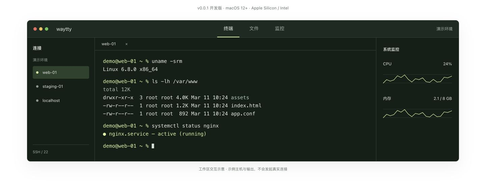
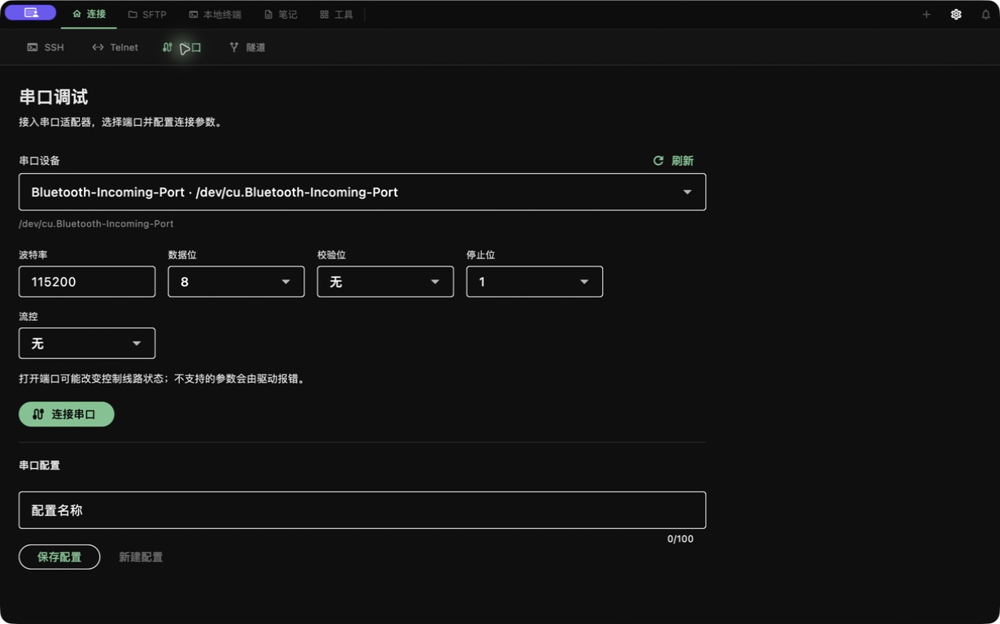
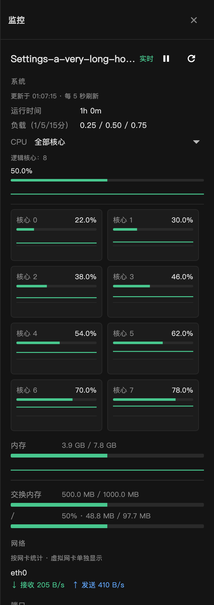
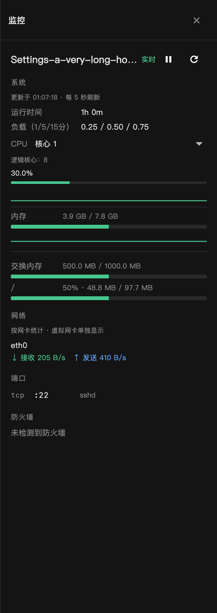

<p align="center"></p>
<h1 align="center">waytty</h1>
<p align="center"><strong>连接远端，工作就在眼前。</strong></p>
<p align="center">面向开发者与运维的开源终端工作区。<br>SSH、SFTP、主机监控与串口调试，收进一个顺手的工具。</p>
<p align="center">
  <a href="https://github.com/wayyoungboy/waytty/releases/tag/v0.0.2"><strong>下载 macOS 版</strong></a> ·
  <a href="https://wayyoungboy.github.io/waytty/">探索官网</a> ·
  <a href="#快速开始">快速开始</a> ·
  <a href="docs/PARITY.md">功能进展</a> ·
  <a href="README_EN.md">English</a>
</p>

[](https://wayyoungboy.github.io/waytty/)
<p align="center"><sub>官网交互示意，使用虚构主机与示例输出，非应用截图。真实界面见下文。</sub></p>
<p align="center"><strong>本地免登录</strong> &nbsp; / &nbsp; <strong>简体中文 · English</strong> &nbsp; / &nbsp; <strong>MIT 开源</strong></p>

## 下载

当前版本为 **v0.0.2**，提供 macOS Universal 安装包，支持 Apple Silicon 与 Intel。

| 平台 | 支持情况 | 获取 |
| --- | --- | --- |
| **macOS** | 12+，Universal：Apple Silicon / Intel | [下载 ZIP](https://github.com/wayyoungboy/waytty/releases/download/v0.0.2/waytty-0.0.2-macos-universal.zip) |
| **Windows** | CI 可构建便携 x64 ZIP；目标平台待验收，暂无正式安装包 | [查看进展](docs/PARITY.md)，CI 工件见 Actions |
| **Android 平板** | CI 可构建分 ABI / universal APK 与 AAB；目标设备待验收 | [查看进展](docs/PARITY.md)，CI 工件见 Actions |

[发布说明](https://github.com/wayyoungboy/waytty/releases/tag/v0.0.2) · [SHA-256 校验文件](https://github.com/wayyoungboy/waytty/releases/download/v0.0.2/SHA256SUMS.txt) · [升级与数据迁移](docs/UPGRADING.md)

> macOS 版本目前为 ad-hoc 签名，尚未完成 Developer ID 签名与 Apple 公证。首次打开如被拦截，请先核对来源和校验值，再按「系统设置 → 隐私与安全性」中的提示操作。无需关闭系统安全机制。升级前请保留连接和文件副本。

## 快速开始

1. **下载并安装。** 从发布页获取 ZIP 与 `SHA256SUMS.txt`，核对 SHA-256。解压后将 `waytty.app` 放入「应用程序」。
2. **连接第一台主机。** 进入「连接 → SSH → 新建连接」，填写地址、端口、用户名及认证信息。首次连接时核对服务器主机指纹。
3. **接着完成工作。** 在终端中执行命令，用 SFTP 传输和编辑文件，打开监控查看 Linux 主机状态。调试硬件则进入「连接 → 串口」。

无需账号即可使用本地工作区；界面语言可在设置中切换并保存。离线时可以管理本机资料，连接远程主机仍需网络。

## 从连接到排查

| 工作环节 | 核心能力 |
| --- | --- |
| **整理连接** | SSH / Telnet、多级分组、收藏、最近访问、搜索与批量连接；手动输入密码或完整私钥，支持跳板链与代理；不自动读取钥匙串、密钥文件或 SSH Agent |
| **操作终端** | 多标签、递归分屏（左右/上下、可嵌套）、广播输入、搜索、会话录制与会话模板 |
| **处理文件** | SFTP、本地与远程面板、传输队列、远程编辑、权限管理与断点续传 |
| **查看状态** | Linux CPU 总体 / 全部核心 / 单核心趋势，内存、磁盘、负载与网卡速率 |
| **调试设备** | 串口参数与配置保存、文本 / HEX 收发、记录导出、定时 / 文件发送和控制信号 |
| **复用经验** | 命令片段、Markdown 笔记、快捷键与脚本工具 |

<details>
<summary><strong>查看真实应用界面</strong></summary>

**连接管理** — 分组、收藏和搜索。截图为无真实主机信息的空白工作区。


**串口调试** — 在连接前配置端口与参数。真实硬件兼容性仍在验证。



**主机监控** — 真实 Flutter 界面使用测试数据渲染。

<p>
  
  
</p>

[主机监控说明](docs/MONITORING.md) · [串口使用说明](docs/SERIAL.md)

</details>

完整功能与验收状态见[功能进展](docs/PARITY.md)。流式 AI 对话和本地 MCP 基础已存在；自动诊断、受控执行与验证仍属于[运维助手规划](docs/plans/AI_OPERATIONS_ASSISTANT.md)。RDP 不在当前范围内，VNC 暂未启用。

## 本地使用与云端备份

**本地模式始终可用。** 连接、分组、笔记与偏好保存在本机，连接密码手动输入；手动粘贴的私钥可随连接在本地加密保存，重启后解锁一次即可复用。不读取系统钥匙串、私钥文件或 SSH Agent。应用不会自动扫描其他软件保存的连接或凭证。

| 模式 | 状态与使用方式 |
| --- | --- |
| **本地离线** | 无需注册。管理本机资料，按需连接远端。 |
| **邮箱账号云端备份** | 开发预览，**不在 v0.0.2 下载包中**。客户端与独立服务端代码已实现，生产服务与邮件投递尚待配置、联调。 |
| **自建账号服务** | 独立 API，默认 SQLite、可切换 MySQL。邮箱验证和 SMTP 由服务端配置；客户端仅需 HTTPS 服务地址。 |

邮箱账号方案使用 **邮箱 + 9–16 位登录密码**，注册后通过 **6 位邮件验证码** 验证邮箱归属。连接设置与连接密码先在客户端加密，再显式保存到云端；恢复时需要独立的保险库密码。私钥文件、AI 密钥及设备设置不在账号备份范围内。

备份采用手动保存 / 恢复，尚无自动合并和版本历史。**遗失保险库密码无法通过重置登录密码恢复密文。** 完整备份范围、加密说明与部署步骤见[账号与云端备份文档](docs/CLOUD_ACCOUNT.md)。服务端独立维护于 [waytty_server](https://github.com/wayyoungboy/waytty_server)。

## 从源码运行

主应用使用 **Flutter + Dart**，位于 `crossplatform/app`。已验证环境：Flutter **3.47.2** / Dart **3.13.2**；macOS 需要 Xcode、CocoaPods，以及 Homebrew 的 `automake`、`libtool`。可通过 `WAYTTY_FLUTTER` 指定 Flutter 可执行文件。

```sh
git clone https://github.com/wayyoungboy/waytty.git
cd waytty

./script/build_and_run.sh --verify  # 编译、签名并检查启动
./script/check_crossplatform.sh    # 本地化、静态分析与测试
```

使用 `./script/build_and_run.sh --release` 生成 Release 应用及 ZIP 并启动。产物为 `dist/waytty.app`、`dist/waytty-macos.zip`。Windows 与 Android 的入口分别为 `script/build_windows.ps1`、`script/build_android.sh`，需要对应系统或 SDK；CI 工作流见 `.github/workflows/windows-android.yml`（产出便携 ZIP / APK+AAB，不等于目标设备已验收）。根目录 SwiftPM 工程为早期参考原型。

<details>
<summary>隔离的 SSH / SFTP 测试</summary>

```sh
python3 -m venv /tmp/waytty-ssh-fixture
/tmp/waytty-ssh-fixture/bin/pip install asyncssh==2.21.1
WAYTTY_SSH_FIXTURE_PYTHON=/tmp/waytty-ssh-fixture/bin/python ./script/check_crossplatform.sh
```

未设置该变量时，真实 SSH / SFTP fixture 测试会跳过。测试不访问用户已保存的服务器。账号 API 的 SQLite / MySQL 集成测试见独立服务端仓库。

</details>

## 文档与参与

| 你想做什么 | 阅读 |
| --- | --- |
| 确认可用功能与平台状态 | [功能进展](docs/PARITY.md) · [验证记录](docs/VERIFICATION.md) |
| 了解工程与数据存储 | [架构说明](docs/ARCHITECTURE.md) · [云端备份](docs/CLOUD_ACCOUNT.md) |
| 改进代码或翻译 | [本地化指南](docs/LOCALIZATION.md) · [上游信息](crossplatform/UPSTREAM.md) |
| 维护官网与发布版本 | [官网开发](website/README.md) · [发布流程](docs/RELEASE.md) · [隐私检查](docs/PRIVACY_REVIEW.md) |

欢迎提交问题、建议与 Pull Request。[反馈问题](https://github.com/wayyoungboy/waytty/issues)时，请附应用版本、系统版本、复现步骤和预期结果。分享日志或截图前，请移除真实主机地址、账号和凭据。

## 许可与致谢

waytty 使用 [MIT 许可证](LICENSE)，基于 MIT 许可的 YourSSH 修改。感谢上游作者与依赖项目维护者。第三方版权、许可与来源信息见 [THIRD_PARTY_NOTICES.md](THIRD_PARTY_NOTICES.md) 和 [UPSTREAM.md](crossplatform/UPSTREAM.md)，并随源码和应用分发。
