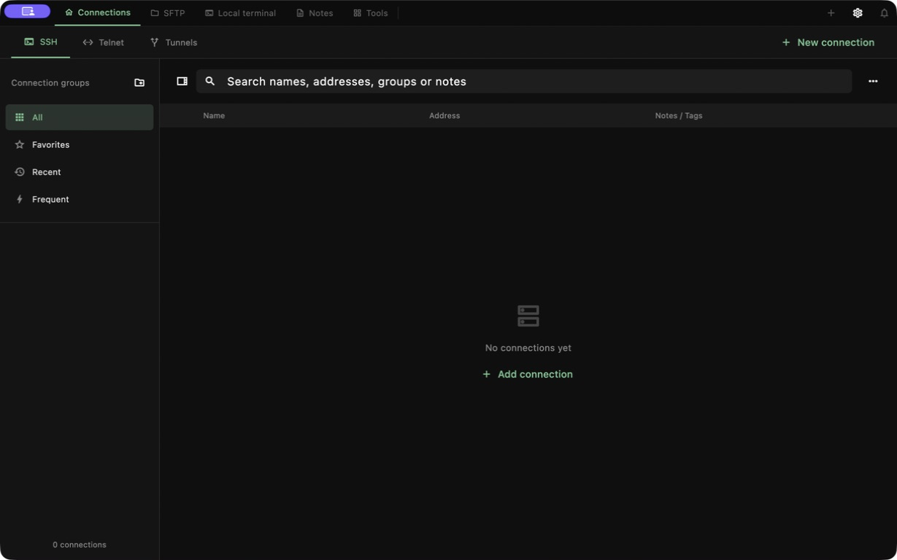

<p align="center"></p>
<h1 align="center">waytty</h1>
<p align="center"><strong>Connect to your world. Stay in your flow.</strong></p>
<p align="center">An open-source terminal workspace for developers and operations.<br>SSH, SFTP, host monitoring and serial debugging, together.</p>
<p align="center">
  <a href="https://github.com/wayyoungboy/waytty/releases/tag/v0.0.3"><strong>Download for macOS</strong></a> ·
  <a href="https://wayyoungboy.github.io/waytty/?lang=en">Explore the website</a> ·
  <a href="#quick-start">Quick start</a> ·
  <a href="docs/PARITY.md">Feature status</a> ·
  <a href="README.md">简体中文</a>
</p>

[](https://wayyoungboy.github.io/waytty/?lang=en)
<p align="center"><sub>Website illustration with fictional hosts and sample output, not an app screenshot. See actual app views below.</sub></p>
<p align="center"><strong>No account required</strong> &nbsp; / &nbsp; <strong>English · 简体中文</strong> &nbsp; / &nbsp; <strong>Open source · MIT</strong></p>

## Download

The current release is **v0.0.3**: a macOS Universal package (Apple Silicon / Intel), plus the first Windows and Android preview packages.

| Platform | Support | Get the app |
| --- | --- | --- |
| **macOS** | 12+, Universal: Apple Silicon / Intel | [Download ZIP](https://github.com/wayyoungboy/waytty/releases/download/v0.0.3/waytty-0.0.3-macos-universal.zip) |
| **Windows** | x64 portable ZIP (not an installer); **not yet validated on target devices** | [Download ZIP](https://github.com/wayyoungboy/waytty/releases/download/v0.0.3/waytty-0.0.3-windows-x64.zip) |
| **Android tablets** | **Debug-signed preview**: not for production; cannot upgrade in place to a future release-signed build, which may require uninstalling first (export a connection backup beforehand); **not yet validated on target devices** | [universal APK](https://github.com/wayyoungboy/waytty/releases/download/v0.0.3/waytty-0.0.3-android-universal.apk) · [arm64-v8a](https://github.com/wayyoungboy/waytty/releases/download/v0.0.3/waytty-0.0.3-android-arm64-v8a.apk) · [armeabi-v7a](https://github.com/wayyoungboy/waytty/releases/download/v0.0.3/waytty-0.0.3-android-armeabi-v7a.apk) · [x86_64](https://github.com/wayyoungboy/waytty/releases/download/v0.0.3/waytty-0.0.3-android-x86_64.apk) |

[Release notes](https://github.com/wayyoungboy/waytty/releases/tag/v0.0.3) · [SHA-256 checksums](https://github.com/wayyoungboy/waytty/releases/download/v0.0.3/SHA256SUMS.txt) · [Upgrading and migration](docs/UPGRADING.md)

> The macOS build is ad-hoc signed, without Developer ID signing or Apple notarization. If macOS blocks the first launch, verify the source and checksum, then follow its **System Settings → Privacy & Security** prompt. There is no need to disable system security. Keep a copy of your connections and files before upgrading.

## Quick start

1. **Download and install.** Get the ZIP and `SHA256SUMS.txt` from the release page. Verify the checksum, extract the archive and move `waytty.app` to Applications.
2. **Connect to your first host.** Choose Connections → SSH → New connection. Enter the address, port, username and authentication details. Verify the server fingerprint on first connection.
3. **Keep work moving.** Run commands in the terminal, transfer and edit files with SFTP, and inspect Linux host metrics in the monitor. For hardware, choose Connections → Serial.

No account is needed for the local workspace. Choose English in Settings; your preference survives restarts. Local data can be managed offline. Remote connections still require a network.

## From connection to resolution

| Workflow | Core capabilities |
| --- | --- |
| **Organize connections** | SSH / Telnet, nested groups, favorites, recent hosts, search and batch connections; manually entered passwords/private keys, jump chains and proxies; no automatic keychain, key-file or SSH Agent access |
| **Work in terminals** | Tabs, recursive split panes (left/right & top/bottom, nestable), broadcast input, search, session recording and templates |
| **Handle files** | SFTP, local and remote panels, transfer queues, remote editing, permissions and resumable transfers |
| **Inspect hosts** | Linux overall / all-core / single-core CPU trends, memory, disk, load and network rates |
| **Debug devices** | Serial settings and profiles, text / HEX transfers, log export, timed / file sends and control signals |
| **Keep useful work** | Command snippets, Markdown notes, shortcuts and scripting tools |

<details>
<summary><strong>View actual application screens</strong></summary>

**Connections** — Groups, favorites and search in an empty demo workspace with no real host information.



**Serial debugging** — Configure the port and parameters before connecting. Physical hardware validation is ongoing.


**Host monitoring** — Real Flutter UI rendered with fixture data.

<p>
  
  
</p>

[Monitoring guide](docs/MONITORING.md) · [Serial guide](docs/SERIAL.md)

</details>

See [feature status](docs/PARITY.md) for implementation and validation details. Streaming AI chat and local MCP foundations exist; automated diagnosis, controlled execution and verification remain part of the [planned operations assistant](docs/plans/AI_OPERATIONS_ASSISTANT.md). RDP is outside the current scope; VNC is not enabled.

## Local use and cloud backup

**Local mode is always available.** Connections, groups, notes and preferences stay on your device. Passwords are entered manually. Pasted private keys can be saved encrypted with each connection and reused after unlocking once per app run. The app does not read the system keychain, private key files or SSH Agent. The app does not automatically scan other applications for saved connections or credentials.

| Mode | Availability |
| --- | --- |
| **Local & offline** | No registration. Manage local data and connect to remote hosts as needed. |
| **Email-account cloud backup** | Development preview, **not in the v0.0.3 download**. Client and standalone server code are implemented; production service configuration and email delivery testing remain pending. |
| **Self-hosted account service** | Standalone API with SQLite by default and optional MySQL. Email verification and SMTP run on your server; clients only need its HTTPS URL. |

The email-account flow uses an **email address and a 9–16 character login password**, followed by a **6-digit email verification code** at registration. Connection settings and connection passwords are encrypted on the client before an explicit cloud save. A separate vault password is required to restore them. Private key files, AI keys and device settings are not included in account backups.

Backup uses manual save / restore, without automatic merging or version history. **Resetting a login password cannot recover a lost vault password.** See [account and cloud backup documentation](docs/CLOUD_ACCOUNT.md) for scope, encryption and deployment. The backend is maintained separately in [waytty_server](https://github.com/wayyoungboy/waytty_server).

## Build from source

The main application uses **Flutter + Dart** in `crossplatform/app`. Validated environment: Flutter **3.47.2** / Dart **3.13.2**. macOS requires Xcode, CocoaPods, and Homebrew `automake` / `libtool`. Set `WAYTTY_FLUTTER` to use a specific Flutter executable.

```sh
git clone https://github.com/wayyoungboy/waytty.git
cd waytty

./script/build_and_run.sh --verify  # Build, sign and check launch
./script/check_crossplatform.sh    # Localization, static analysis and tests
```

Use `./script/build_and_run.sh --release` to produce and launch a Release app and ZIP. Outputs: `dist/waytty.app` and `dist/waytty-macos.zip`. Windows and Android entry points are `script/build_windows.ps1` and `script/build_android.sh`; they need the corresponding platform or SDK. CI packaging lives in `.github/workflows/windows-android.yml` (portable ZIP / APK+AAB; not the same as target-device acceptance). The root SwiftPM project is an earlier reference prototype.

<details>
<summary>Isolated SSH / SFTP tests</summary>

```sh
python3 -m venv /tmp/waytty-ssh-fixture
/tmp/waytty-ssh-fixture/bin/pip install asyncssh==2.21.1
WAYTTY_SSH_FIXTURE_PYTHON=/tmp/waytty-ssh-fixture/bin/python ./script/check_crossplatform.sh
```

Without this variable, real SSH / SFTP fixture tests are skipped. Tests do not connect to your saved servers. SQLite / MySQL account API integration tests live in the separate server repository.

</details>

## Documentation and contributing

Most technical guides are currently in Chinese.

| You want to… | Start here |
| --- | --- |
| Check features and platform support | [Feature status](docs/PARITY.md) · [Verification notes](docs/VERIFICATION.md) |
| Understand architecture and storage | [Architecture](docs/ARCHITECTURE.md) · [Cloud backup](docs/CLOUD_ACCOUNT.md) |
| Improve code or translations | [Localization](docs/LOCALIZATION.md) · [Upstream information](crossplatform/UPSTREAM.md) |
| Maintain the website or releases | [Website development](website/README.md) · [Release process](docs/RELEASE.md) · [Privacy checks](docs/PRIVACY_REVIEW.md) |

Issues, ideas and pull requests are welcome. [Report a problem](https://github.com/wayyoungboy/waytty/issues) with the app version, operating system, reproduction steps and expected behavior. Remove real host addresses, accounts and credentials from logs and screenshots.

## License and acknowledgements

waytty is [MIT licensed](LICENSE), based on the MIT-licensed YourSSH project. Thanks to upstream authors and dependency maintainers. Third-party attribution, licenses and source information are preserved in [THIRD_PARTY_NOTICES.md](THIRD_PARTY_NOTICES.md) and [UPSTREAM.md](crossplatform/UPSTREAM.md), and distributed with the source and application.

Legacy sync-code access has been removed; existing installations return to local mode. QR transfer remains available. Realtime terminal sharing is temporarily unavailable pending a self-hosted transport. See [migration notes](docs/UPGRADING.md).
