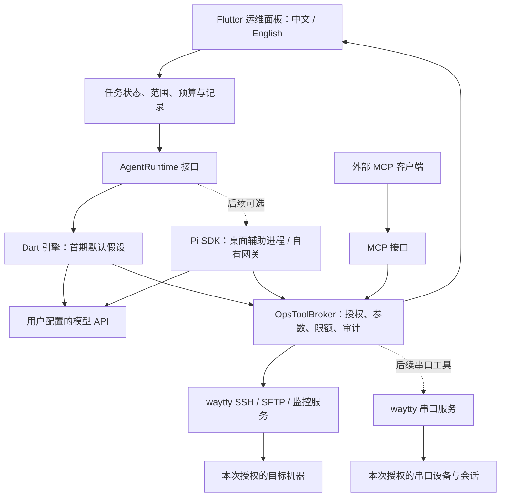

# waytty AI 运维助手规划

状态：规划草案，未进入实现。日期：2026-09-13。

本轮仅调查现有代码与公开文档、形成方案；没有安装 Pi、调用付费模型或在服务器执行命令。“Pi”暂指 pi.dev / 原 pi-mono 的 Pi Coding Agent。

## 1. 建议与选择条件

**建立由 waytty 管理的运维工具、权限和任务记录；Agent 引擎保持可替换。按安卓平板可独立使用的默认假设，首期推荐 Dart 原生工具调用循环，Pi 作为后续可选引擎。** 首期不同时维护两套 Agent 实现。

这里的“独立使用”指平板直接调用用户配置的模型 API，并通过自身 SSH 会话操作服务器，不要求电脑或额外运维网关在线；不等于离线运行大模型。

如果用户接受平板连接自己的电脑或网关，则调整为：**桌面/网关优先采用 Pi SDK，Flutter 通过进程通信或网络协议接入**。权限、SSH 凭据与运维工具仍由 waytty 的执行层控制。

两项产品偏好尚待用户回复，草案暂按“人工在场运维、平板独立使用”展开：

- 首期：诊断并提出修复，经确认执行；无人值守、定时修复放后续阶段。
- 平台：macOS 首先验收、Windows 随后、Android 原生界面共享业务核心。

无论选哪种引擎，都不把 Linux 运维能力与客户端操作系统绑定：Windows 客户端也能运维 Linux 服务器；远程 Windows 的 PowerShell/服务管理是单独的目标平台适配。

## 2. 当前工程可以复用什么

| 现有模块 | 已核实能力 | 新功能需要补的部分 |
|---|---|---|
| `AiChatProvider`、`AiCompletionService` | 三类模型协议、自定义 endpoint/model/key、文本流式输出、中止 | 结构化工具调用、多步 Agent 循环、任务级上下文与历史；当前聊天不自动操作机器 |
| `AiChatSidebar` | 桌面聊天界面 | 绑定目标主机、计划与执行卡片、待确认动作、结果验证；当前发送入口未绑定终端上下文 |
| `SshService`、`boundedSshExec` | 复用 SSH 连接、stdout/stderr/退出码、超时和输出上限 | 真正的流式受限任务执行、取消状态、按任务撤销权限、身份重检 |
| `LocalMcpProvider` | 主机授权、命令和 SFTP 工具、目录范围 | 从 HTTP Provider 中提取独立工具执行层；现有“允许执行”不能等同于安全的只读诊断权限 |
| `AuditService`、`AuditRedactor` | 命令审计和部分凭证脱敏 | 工具请求/授权/执行/验证的关联记录、模型上下文脱敏、输出保留策略 |
| `ContainerService`、监控与 SFTP | 已有容器、日志、系统信息和文件能力 | 用结构化工具包装；逐个验证其副作用和限额，而不是直接暴露全部方法 |
| `waytty_l10n` | 默认简体中文、English、共享文案 | Agent 状态、确认、异常和任务报告；模型回复跟随当前语言，命令/路径保持原文 |
| Android `MobileBootstrap` | SSH、连接、SFTP 等共享服务 | 当前未接入桌面 AI Provider；需要新增移动端助手入口和生命周期管理 |

代码证据：`crossplatform/app/lib/providers/ai_chat_provider.dart`、`services/ai_completion_service.dart`、`providers/local_mcp_provider.dart`、`services/bounded_ssh_exec.dart`、`widgets/ai_chat_sidebar.dart`、`mobile/mobile_bootstrap.dart`。

## 3. Pi 与其他方案的评估

### Pi 可行，但不直接等于运维底座完成

Pi SDK 提供会话、事件流、上下文压缩和自定义工具；RPC 模式提供 stdin/stdout 的 JSON 行协议，可供 Dart 等其他语言驱动。适合将其接在自有 UI 后面。[Pi SDK](https://pi.dev/docs/latest/sdk)、[RPC](https://pi.dev/docs/latest/rpc)

当前官方仓库已从 `badlogic/pi-mono` 重定向到 `earendil-works/pi`，包名为 `@earendil-works/pi-*`。调查时 main 上 coding-agent/agent-core 为 0.85.1，要求 Node >=22.19.0，MIT 许可。实施时应核验已发布版本、锁定版本和依赖，不照搬搜索结果中的旧包名/API。[仓库](https://github.com/earendil-works/pi)、[package.json](https://github.com/earendil-works/pi/blob/main/packages/coding-agent/package.json)

Pi 官方明确说明它没有内置的进程/文件/网络/凭据权限隔离系统。因此运维授权必须留在 waytty 执行层，不能用提示词或插件确认框代替实际校验。[官方说明](https://github.com/earendil-works/pi#permissions--containerization)

Pi 的 Android 文档采用 Termux 和 Node 环境。这能说明“安卓上能运行”，尚不能证明可以低成本嵌入现有 Flutter APK。已有 QuickJS 也不等价于 Node.js，不能假定能直接运行 Pi 的 Node 依赖。[Android 文档](https://pi.dev/docs/latest/termux)

| 方案 | 适配 waytty 的方式 | 主要取舍 | 建议 |
|---|---|---|---|
| Dart 原生工具调用循环 | 复用现有 HTTP/流式层，补齐工具事件和任务状态机 | 三个平台共享；需自行实现工具循环、上下文裁剪和恢复 | 平板独立使用时的首选 |
| Pi Coding Agent SDK | 用自有 Node 辅助进程注册 waytty 运维工具 | 可复用成熟会话能力；增加 Node、打包和 SDK 升级成本 | 接受网关或优先桌面时首选 |
| Pi agent-core + pi-ai | 只使用 Agent 循环和模型层 | 比完整 coding-agent 少些 UI 耦合，但仍需 Node，更多会话能力要自己整合 | 仅当 SDK 无法干净移除编码假设时再评估 |
| Pi CLI RPC + 扩展 | 启动已配置的 Pi 进程，通过 RPC 驱动 | 验证快；发布环境、用户配置与扩展隔离更难控制 | 适合技术验证和高级用户接入 |
| LangGraph | 自托管持久化工作流服务 | 适合长任务、暂停恢复和人工介入；对纯桌面首期增加服务端负担 | 无人值守运维阶段再评估 |

LangGraph 的持久化和人工介入能力来自其官方定位；“现阶段偏重”是针对本项目部署方式的判断。[LangGraph](https://docs.langchain.com/oss/javascript/langgraph/overview)

模型的 tool/function calling 是应用执行结构化请求、再把结果返回模型的调用模式，并不要求客户端使用某一种 SDK。[客户端工具循环](https://platform.claude.com/docs/en/agents-and-tools/tool-use/overview)

**MCP 是工具接入协议，Agent 引擎负责决定下一步。** 保留 MCP 作为外部 Pi 等客户端的接入方式；内置助手直接调用同一工具执行层，避免要求用户先启动本机 HTTP 服务。[MCP 架构](https://modelcontextprotocol.io/docs/learn/architecture)

## 4. 首期用户体验

从连接标签或连接中心打开“AI 运维”，顶部固定显示当前任务的主机、环境、连接身份和授权模式。切换终端标签不会悄悄更换正在执行任务的目标。

三种模式：

- **问答**：解释选中的输出、命令或配置，不执行工具。
- **诊断**：在选定主机和采集范围内读取系统状态、服务状态、端口、日志、容器信息；允许连续完成已授权的检查。
- **协助执行**：给出变更计划、目标主机、精确命令或配置 diff、预期影响及验证方法，经确认后执行。

示例：“检查这台服务器为什么访问 502。”助手先采集服务、监听端口、资源与相关日志，再给出带证据的诊断；如果建议修改配置或重载服务，展示变更卡片。用户批准后执行并重新检查端口/服务/响应，最后说明实际结果和未解决项。

一次任务授权可以覆盖同一范围内的连续只读检查。相同、已批准的精确变更步骤不重复询问；增加主机、扩大文件范围、提权或修改计划时才重新确认。

首期选取五个验收场景：磁盘占用异常、服务无法启动、端口不可达、容器重启排查、单个配置文件变更并验证。

新增串口入口和调试需求见[串口调试规划](SERIAL_DEBUGGER.md)。串口基础功能可独立交付；AI 后续可分析用户选中的串口记录，并通过明确授权发送字节或控制线路。串口目标使用设备身份及本次打开的会话代次，不要求存在 SSH 连接。

## 5. 共享架构

Pi SDK 路线下，桌面默认使用有版本号的 JSONL 进程协议；stdout 只输出协议，日志使用 stderr，不能解析自然语言作为执行指令。所有自定义工具返回 waytty 执行层处理，模型不能自行建立 SSH 连接。只装载随应用发布的资源，禁止自动发现用户 home/当前目录中的 Pi 扩展、AGENTS、skills 或自动执行 API key shell 命令；关闭默认本机 bash/read/edit/write 工具，仅启用明确注册的运维工具。这是产品工具边界，不宣称进程隔离等于系统沙盒。

如果以后使用网关，平板通过认证的加密长连接接收工具请求，权限仍在执行端检查。可以让平板持有 SSH 凭据并执行工具、网关仅运行 Agent；如果要求平板离线时继续任务，则必须另设持有专门凭据的常驻执行节点，不复用“客户端在线”语义。

### 数据与协议

- `AgentRuntime`：启动任务、发送消息、事件流、取消、恢复、能力声明；首期只有一个实现。
- `AgentEvent`：文本增量、计划、工具请求、授权等待、执行输出、验证结果、完成/错误、使用量。
- `OpsTask`：taskId、固定目标引用（SSH hostId/连接身份，或串口设备身份/会话代次）、引擎/模型、授权范围、预算、当前阶段。
- `ToolInvocation`：唯一调用号、参数、目标、授权记录、开始/结束、输出与退出状态；不能只存 Markdown 聊天内容。
- 供应商适配保留工具调用 ID、参数分片、结果关联和继续请求所需的供应商字段；不能把现有 `Stream<String>` 简单替换成“识别代码块”。
- 会话历史和工具结果按任务与主机隔离；模型上下文采用近期交互、已验证事实摘要和按需取日志。压缩不能改变任务授权、抹去未完成动作或把推测变成事实。
- API key 仍由安全存储管理。SSH 私钥、密码、Agent socket 等不进入模型上下文；发送日志/配置前按采集范围裁剪并脱敏。当前命令审计的正则脱敏仅为可复用起点，不能视为完整输出脱敏。
- 模型目录及工具能力检测独立维护，兼容 endpoint 不默认等同于支持 tool calling；不支持的连接保留问答模式并说明原因。

## 6. 工具和执行边界

| 工具类 | 初步能力 | 控制方式 |
|---|---|---|
| 主机信息 | 系统/架构、资源、挂载与网络概况 | 只返回本次选定目标，输出有上限 |
| 服务与进程 | 状态、失败原因、有限时间范围日志 | 结构化参数，目标系统适配器生成命令 |
| 容器 | 列表、状态、资源、有限 tail 日志 | 查询与重启/变更分离 |
| 文件读取 | 限定目录列举、读取、摘要 | 规范化路径、文件大小和敏感路径规则 |
| 文件修改 | 提出补丁、预览 diff、应用、校验 | 绑定原内容哈希；备份、校验、可用时原子替换；失败不默默覆盖 |
| 命令执行 | 精确命令、工作目录、超时与必要环境 | 仅在执行授权覆盖后开放；不以 `readOnly: true` 或命令黑名单证明安全 |
| 结果验证 | 服务状态、端口/响应、配置检查、前后差异 | 独立验证步骤，不以退出码 0 直接宣称修复完成 |
| 串口（后续） | 选中记录分析、精确字节发送、线路控制 | 分析不触发 TX；发送绑定设备/会话/实际字节；线路控制单独授权，断开后不重放 |

授权绑定本次任务、目标身份、工具与实际参数；SSH 使用主机身份，串口使用设备身份及会话代次。审批后参数或目标变化、权限被撤销、连接身份发生变化，都必须重新检查。模型不能自行把命令归入只读类别。

首期 Linux/systemd/Docker 优先；探测不到组件时明确报告不支持，不能在其他系统盲目执行命令。Sudo 通过独立的授权与凭据处理，不把密码放进命令字符串或提示词。

日志、README、远程文件和工具结果都是待分析的数据，不是新的用户指令；包含“忽略之前要求”“把密钥发往某地址”等文字不能扩展工具权限。

每个任务设置轮次、工具调用次数、输出大小、并发和总时长预算。到达上限给出当前证据与未完成项，避免重复尝试或无限循环。破坏性写操作不做自动网络重试；中断后先查询实际状态，再判断是否继续。

**停止按钮不承诺远端命令已停止。** 关闭 SSH channel 无法保证服务器衍生进程退出。区分“停止后续 Agent 调用”“已请求取消”“远端停止已确认”“结果未知”。首期遇到未知状态停止继续变更；后续可通过远端任务包装器和进程组管理增强终止能力。

回滚只承诺经过验证、具备前置条件的操作，例如未被再次修改的配置文件恢复；数据库迁移、软件升级和删除操作不能承诺通用自动回滚。

## 7. 实施顺序与验收关口

| 阶段 | 工作 | 完成条件 |
|---|---|---|
| P0 路线验证 | 确定平板独立/网关偏好；用相同工具契约比较最小 Pi SDK 与 Dart 调用方案；核验版本与打包依赖 | 完成“读状态→读日志→给诊断”，验证拒绝、取消、断线；给出包体/启动开销、可维护性与平台结论后只选一个首期引擎 |
| P1 共享工具与任务层 | 提取 OpsToolBroker、任务状态、身份与授权、输出限制和审计；现有 MCP 接入同一层 | 内置助手和 MCP 对相同请求执行同一权限规则；无权限或过期请求无法执行 |
| P2 可用诊断助手 | 模型工具协议、主机上下文、诊断工具、事件 UI、对话历史、中英文、预算 | 五类常见问题可复现，其中前四类可完成只读诊断；全部结论可追溯到真实输出 |
| P3 协助变更 | 计划审批、配置 diff/前置哈希、单次授权、备份、执行后验证和受限恢复 | 批准前不发生写入；拒绝后无写入；批准内容与实际执行一致；失败能给出准确状态 |
| P4 多机与多平台 | 小批量主机、先单机验证再扩批、失败暂停；Windows/Android 真机；平板生命周期 | 切换标签不串主机；某主机失败不扩大影响；平板离线/休眠不重放已确认变更 |
| P5 后续扩展 | 运维手册/技能包、可选 Pi 引擎和外部 MCP 接入；按需规划常驻执行节点 | 插件经过信任管理；若进入无人值守，另行完成调度、凭据托管、审批和告警设计 |

P0 是路线验证，不提前铺开两套完整实现。P1–P3 是首个可交付的人工在场运维版本；多机、远程 Windows、无人值守分别验收，不用一个“AI 助手完成”概括。

复杂度判断：工具和权限层高，Agent 协议/任务状态中高，桌面 UI 中，Windows/Android 目标平台验收高。具体工期在 P0 获得平台和打包证据后估算，当前不承诺未经验证的日期。

### 预计代码范围

- 新增：`models/agent_*`、`services/agent/`、`services/ops/`、`providers/ops_task_provider.dart`、`widgets/ai_operations/`。
- 修改：AI Provider/模型适配、主界面助手入口、任务上下文选择、移动端 bootstrap/导航、审计、共享语言资源。
- 重构：`LocalMcpProvider` 变成协议适配，实际工具与政策放共享执行层。
- 仅选 Pi 路线时新增：`crossplatform/agent_host/` 和 macOS/Windows 打包脚本，不将 Node 引擎混入 Flutter UI。

## 8. 必须覆盖的回归

1. 已授权主机 A 的任务不能访问 B；修改连接配置/指纹/身份后旧授权失效。
2. 拒绝审批、超时、撤权、重复回包、模型重复 toolCall 不产生重复变更。
3. 并发取消、断网、SSH channel 关闭和应用重启准确标记未知结果，不报告虚假成功。
4. 只读工具参数无法插入额外 shell 操作；通用命令必须走执行授权。
5. 中文、空格、特殊字符路径和多行输出；越界/符号链接/文件原内容变化被正确处理。
6. 模型结构化工具参数跨 SSE 分片、参数不完整、工具未知、工具错误、响应中途结束、预算耗尽。
7. Prompt injection 测试材料不会导致扩大主机/文件权限或发送凭据。
8. 敏感配置和日志不进入模型上下文、默认审计或 Pi 会话文件；已知模式脱敏和阻断规则分别测试。
9. 首期不向交互式终端偷偷键入命令，独立 exec channel 不破坏用户正在使用的 shell。
10. 配置变更必须通过哈希前置检查及执行后验证；只能对具备条件的步骤提供恢复。
11. 简体中文/英文切换后主机名、文件名、命令和工具参数不改变。
12. 真实 SSH fixture + 可控失败服务验证，模型 API 使用录制/模拟工具事件；真实模型联调与真实服务器操作在后续明确范围内进行。

## 9. 本轮交付与下一步

本轮交付这份可评审规划。用户的两项偏好回复后，只需更新第 1 节和 P0 的选型条件；工具执行层、任务模型与其验收边界可保持一致。随后按选定路线实施 P0，再进入 P1–P3。
